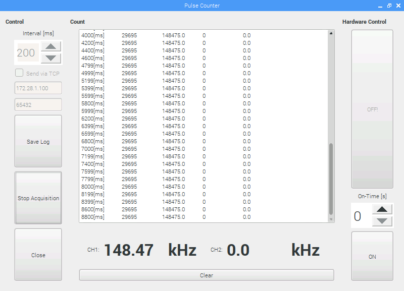

# RPi-Frequency-Counter-Software

##Requirements:

 - WiringPi

This PyQt project is the graphical interface for the pulse counter published in [this page](https://github.com/atzengin/RPi-Frequency-Counter)

